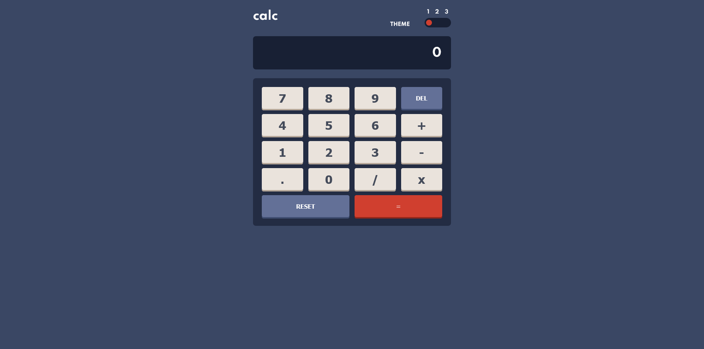
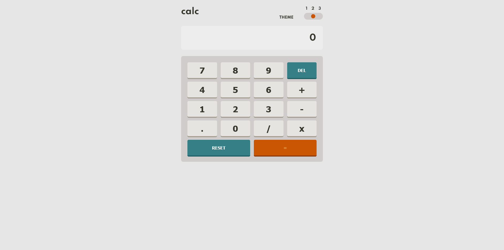
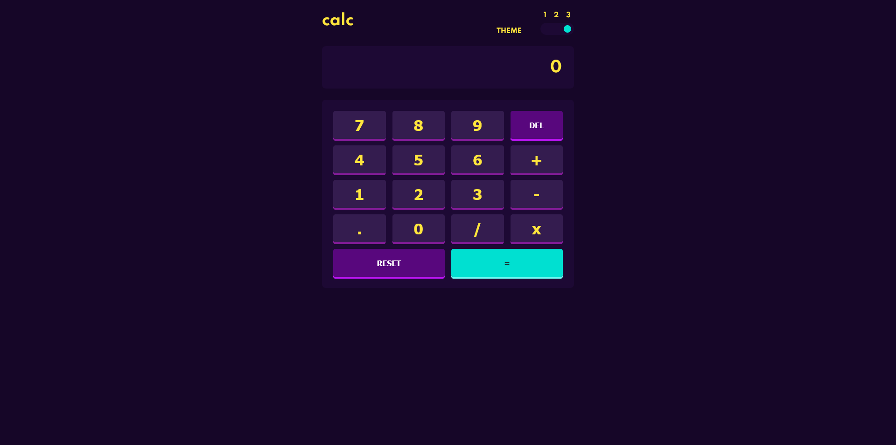

# Frontend Mentor - Calculator app solution

This is a solution to the [Calculator app challenge on Frontend Mentor](https://www.frontendmentor.io/challenges/calculator-app-9lteq5N29). Frontend Mentor challenges help you improve your coding skills by building realistic projects. 

### The challenge

Users should be able to:

- See the size of the elements adjust based on their device's screen size
- Perform mathmatical operations like addition, subtraction, multiplication, and division
- Adjust the color theme based on their preference
- **Bonus**: Have their initial theme preference checked using `prefers-color-scheme` and have any additional changes saved in the browser

### Screenshot

### Links

- Solution URL: [Github repo](https://github.com/JuaniSilva/Calc-FEM)
- Live Site URL: [Github Page](https://juanisilva.github.io/Calc-FEM/)

### Built with

- Semantic HTML5 markup
- Native CSS
- Flexbox
- Mobile-first workflow
- [VueJS](https://v3.vuejs.org/) - Vue 3 library 

### Useful resources

- [Vue 3 Docs](https://v3.vuejs.org/guide/introduction.html) - This helped me with absolutley everything I didn't know about the framework
## Author

- Website - [Juani Silva](https://github.com/JuaniSilva)
- Frontend Mentor - [@JuaniSilva](https://www.frontendmentor.io/profile/JuaniSilva)
- Twitter - [@Juani_Silva13](https://twitter.com/Juani_Silva13)
